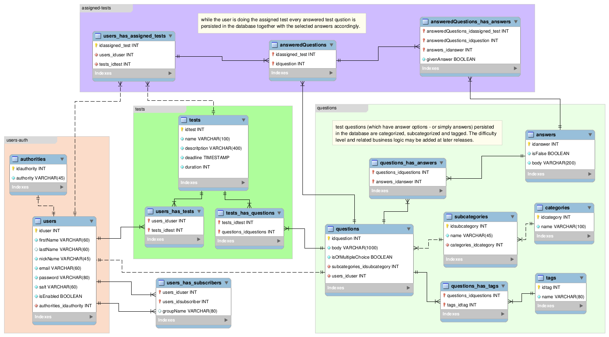

# jd2-project-test-sys
<h>jd2 course work "test system" implements basic functionality for:<h>
<ol>
 <li>
  test tasks compilation/creation (test constructor allows to produce your own questions and/or compile test tasks from available ready made categorazed and tagged questions);
 </li>
<li>
  test tasks assignment (within the group of subscribers);
</li>
<li>
  results and (possibly) feedback collection;
</li>
</ol>

**environment: tomcat9, spring-core v.5.x, spring-security v.5.x, hibernate v.5.x, MariaDB v.10.3**

db schema:
