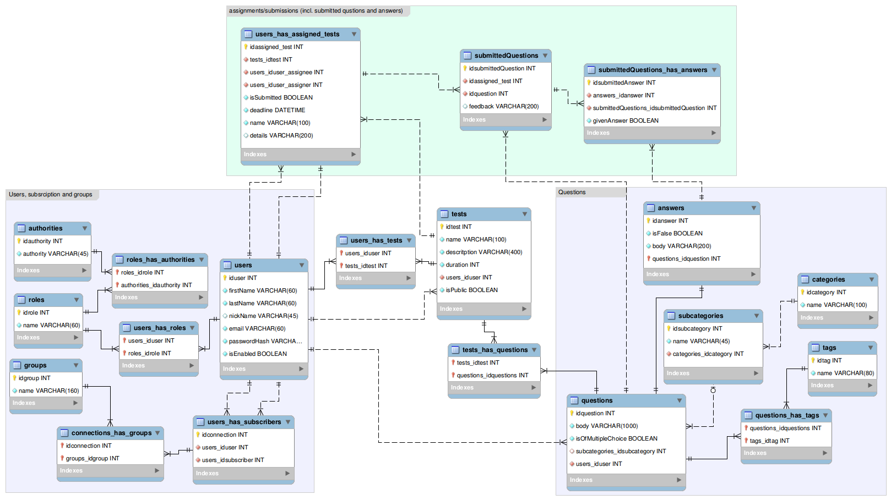

# javaEE coursework (@it-academy)
<h2> jd2 course work "quiz system" implements basic functionality for: </h2>
<ol>
 <li>
  quiz tasks compilation/creation (quiz constructor allows to produce your own questions and/or compile test tasks from available ready made categorazed and tagged questions);
 </li>
<li>
  test tasks assignment (within the group of subscribers);
</li>
<li>
  results and (is there is any) feedback collection;
</li>
</ol>
 
**stack: Tomcat(v9), MySql(MariaDB v10.3), Java(spring-core v.5.x, spring-security v.5.x, hibernate v.5.x), Bootstrap(v4)**
 
<i>stateless authorization, validation and propper logging are to be implemented (there shall be only clean code... better sooner than later...)</i>
 
<strong>db schema:</strong>

